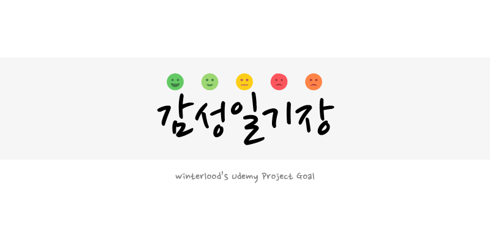
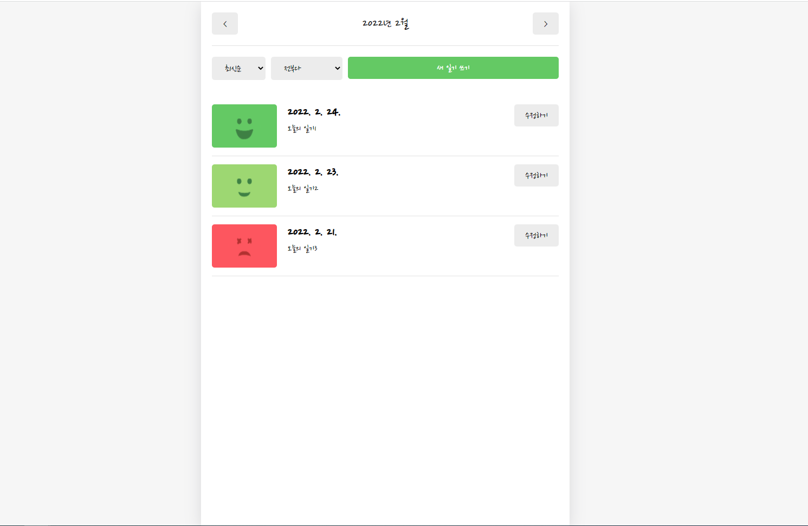
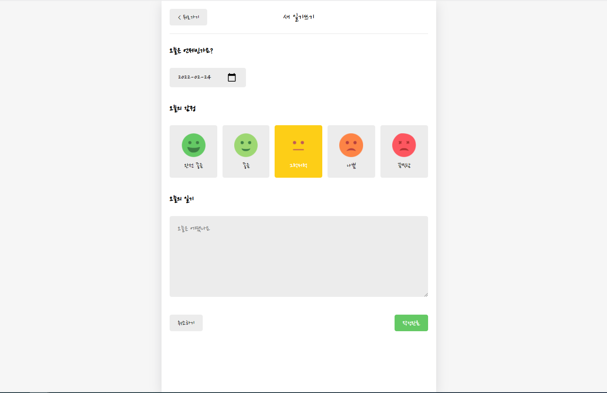
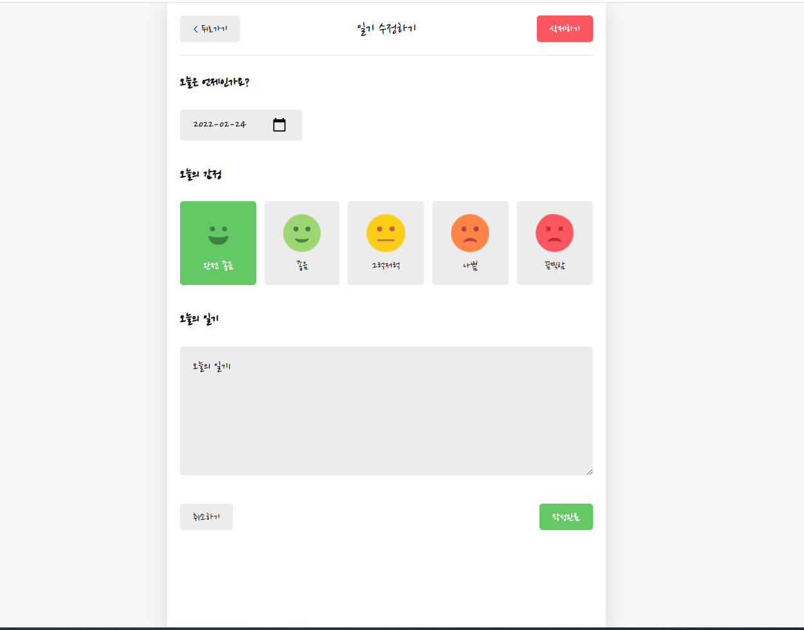
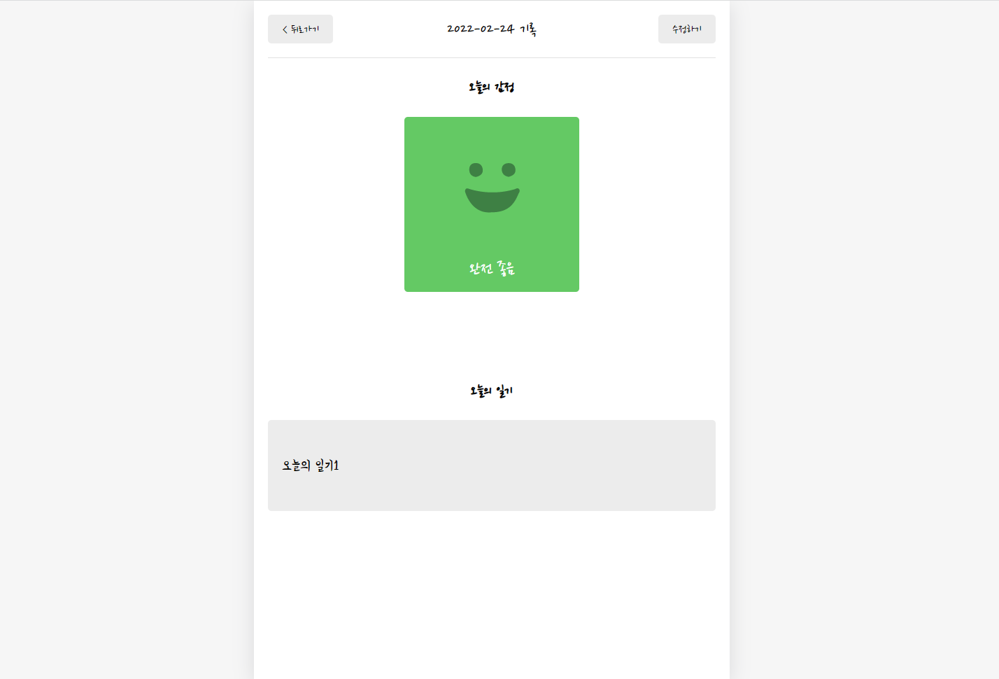

<br/>
<p align="middle">
  
</p>
<h2 align="middle">감성 일기장 앱</h2>
<p align="middle">React JS로 구현 하는 일기장 앱</p>
<p align="middle">
  
  
  
  
    
</p>

## 🔥 Projects

<p align="middle">
  
</p>

<br/>

## 🎯 페이지 구현 - 홈(/)

<p align="middle">
  
</p>

## 🎯 페이지 구현 - 일기 쓰기(/new)

<p align="middle">
  
</p>

## 🎯 페이지 구현 - 일기 수정(/edit)

<p align="middle">
  
</p>

## 🎯 페이지 구현 - 일기 상세(/diary)

<p align="middle">
  
</p>

## 📝 배포 (Firebase)

### Url

`http://jonghae5-diary.web.app`

<p align="middle">
  
</p>

## ⚙️ Start

```
npm run build
```

```
firebase deploy
```

<br/>

## 💻 Code Review & 👏🏼 Contributing

만약 개선사항이 필요하다면, 언제든 자유롭게 PR을 보내주세요.

<br/>
